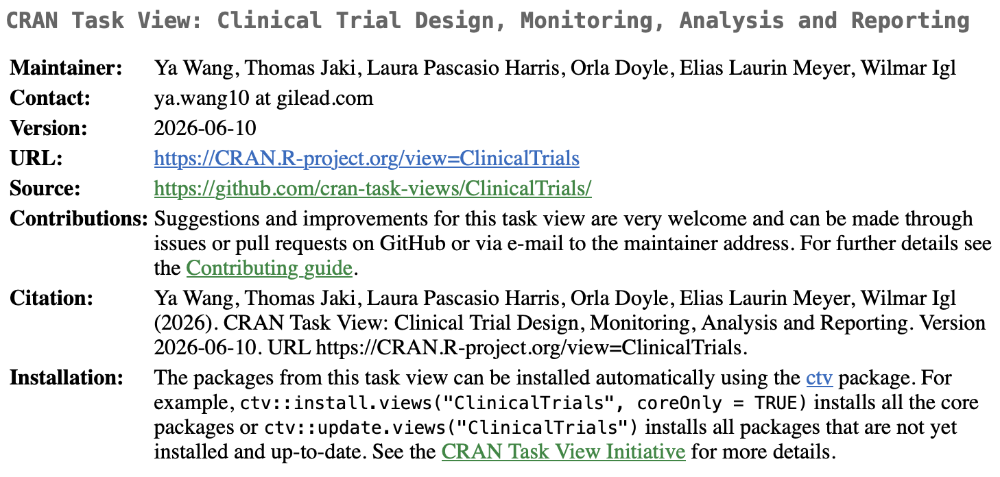

We are pleased to announce the release of an updated version of the [CRAN Task View on Clinical Trials](https://cran.r-project.org/web/views/ClinicalTrials.html), published on June 10, 2026. This update features a curated collection of R packages relevant to clinical trial design, monitoring, analysis, and reporting.

The Task View serves as a practical resource for statisticians, programmers, and clinical researchers across the pharmaceutical industry, facilitating efficient identification of packages for common and advanced analytical needs. We thank the contributors and maintainers for their continued efforts in keeping this resource current, and we encourage the community to explore the updated content and provide feedback for future enhancements.

{fig-align="\"center"}
