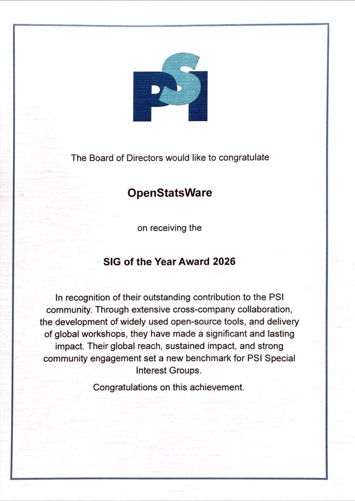

openstatsware was awarded "SIG of the Year" at the PSI conference gala dinner in Belfast on 16th June. The award recognizes the significant contributions and impact of openstatsware within the PSI community: 

> In recognition of their outstanding contribution to the PSI community. Through extensive cross-company collaboration, the development of widely used open-source tools, and delivery of global workshops, they have made a significant and lasting impact. Their global reach, sustained impact, and strong community engagement set a new benchmark for PSI Special Interest Groups.

We are honored to receive this recognition and would like to thank everyone who has supported us along the way - in particular we are grateful to be part of the PSI community of SIGs and look forward to continuing to collaborate with the community in the future.

{width=50%}

The award includes the opportunity for a free session at the next PSI conference 2027. We are excited and plan to prepare a fantastic session for next year's event!